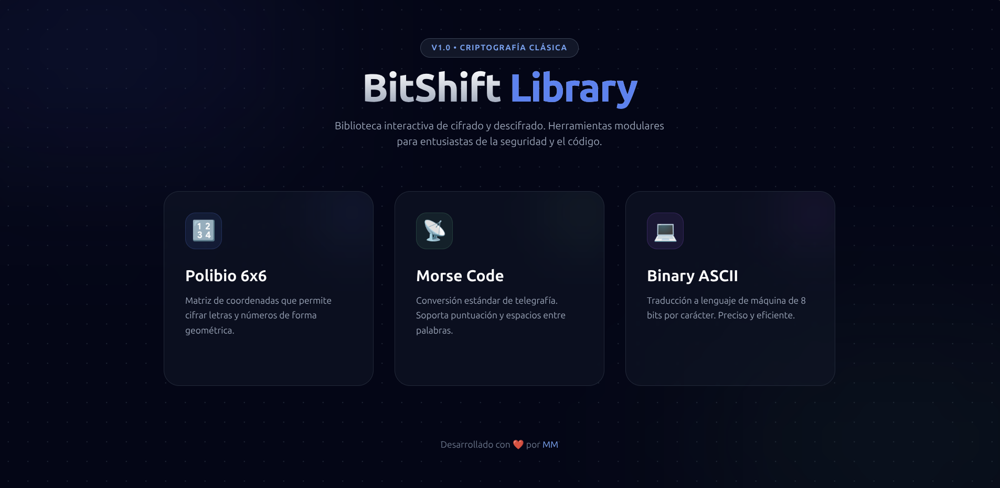
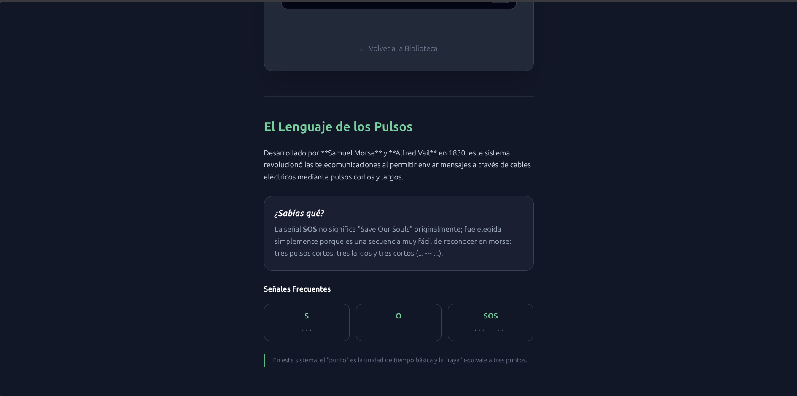

# BitShift Library


BitShift Library es una biblioteca interactiva y educativa de herramientas de cifrado clásico y moderno. Diseñada con un enfoque minimalista y profesional, permite a los usuarios transformar mensajes utilizando diversos métodos históricos y técnicos.



[Ver Demo en Vivo aquí](https://moisescx.github.io/bitshift/)

---

## 🛠️ Herramientas Incluidas

La suite cuenta con tres módulos principales, cada uno con su propio contexto histórico y educativo:

* 🔢 Cuadrado de Polibio (6x6): Una versión extendida del clásico tablero griego que permite cifrar letras (A-Z) y números (0-9) mediante coordenadas.
* 📡 Código Morse: Traductor completo de telegrafía que soporta caracteres alfanuméricos y signos de puntuación esenciales.
* 💻 Binario (ASCII): Conversor de texto a lenguaje de máquina de 8 bits, ideal para entender cómo procesan la información las computadoras.

---

## 🚀 Tecnologías Utilizadas

Este proyecto destaca por una arquitectura limpia y sin dependencias pesadas:

* JavaScript (ES6+): Lógica modular con `import/export` para un mantenimiento sencillo.
* Tailwind CSS: Diseño responsivo y moderno con estética *Glassmorphism*.
* HTML5: Estructura semántica y accesible.

---



## 📁 Estructura del Proyecto

```text
bitshift/
├── img/                
│   ├── img1.png
│   └── img2.png
├── index.html          # Menú principal de la suite
├── js/                 # Lógica modular (Módulos JS)
│   ├── polibio.js
│   ├── morse.js
│   └── binario.js
├── views/              # Interfaces individuales
│   ├── polibio.html
│   ├── morse.html
│   └── binario.html
└── README.md
```

## 📈 Próximas Actualizaciones

[ ] Implementación del Cifrado César con desplazamiento variable.

[ ] Modo de visualización de matriz en tiempo real para Polibio.

[ ] Efectos de sonido tipo "beeps" para el Código Morse.
